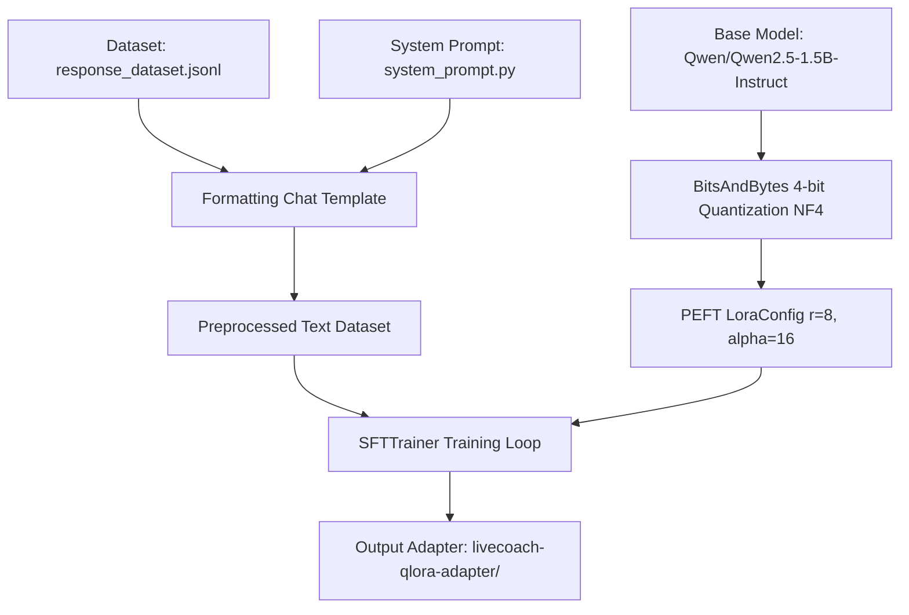

# LiveCoach LLM - QLoRA Fine-Tuning Module

Dokumentasi resmi untuk modul pelatihan (*fine-tuning*) Large Language Model (LLM) **LiveCoach** menggunakan metode **QLoRA (Quantized Low-Rank Adaptation)** 4-bit.

---

## 📌 1. Lokasi File & Struktur Modul (`AI/LLM/`)

Proyek ini terstruktur dengan rapi untuk memisahkan antara materi sumber (*knowledge base/dataset*) dan script pelatihan/model output:

```text
AI/LLM/
├── grounded_llm/                    # [Materi Sumber / Knowledge Base]
│   ├── Action Engine/               # Modul pemroses aksi/aturan
│   ├── Knowledge Base/              # Data fakta produk (product_facts_v2.json)
│   ├── LLM dengan QLoRA/            # Prompt sistem (system_prompt.py) & template awal
│   ├── Response Dataset/            # Dataset latih (response_dataset.jsonl)
│   ├── Validator/                   # Script evaluasi/validasi laporan
│   ├── DECISIONS_LOG.md             # Catatan keputusan arsitektur
│   └── README.md                    # Dokumentasi grounded_llm
├── train_llm.py                     # [Script Utama Training Python]
├── run_training.sh                  # [Script Wrapper Eksekusi Bash]
├── livecoach-qlora-adapter/         # [MODEL AI HASIL TRAINING]
│   ├── adapter_model.safetensors    # Bobot model LoRA 8.7 MB
│   ├── adapter_config.json          # Konfigurasi rank & target modules
│   └── tokenizer*                   # Konfigurasi & vocab tokenizer
└── .gitignore                       # Menyaring file environment raksasa (.venv)
```

### Detail Lokasi Komponen Utama:
* **Lokasi Script Training**: `AI/LLM/train_llm.py`
* **Lokasi Dataset**: `AI/LLM/grounded_llm/Response Dataset/response_dataset.jsonl`
* **Lokasi System Prompt**: `AI/LLM/grounded_llm/LLM dengan QLoRA/system_prompt.py`
* **Lokasi Model AI Final**: `AI/LLM/livecoach-qlora-adapter/`

---

## 🔄 2. Alur Pelatihan (Training Workflow)

Pelatihan LLM menggunakan arsitektur **Qwen2.5-1.5B-Instruct** yang di-*fine-tune* secara efisien dengan **QLoRA (4-bit NF4 Quantization)**:



### Tahapan Detail:
1. **Data Loading & Preprocessing**:
   - Memuat dataset `response_dataset.jsonl` (60 contoh data percakapan).
   - Menggabungkan `SYSTEM_PROMPT` dengan pesan `user` dan `assistant` menggunakan standar `apply_chat_template` Qwen2.5.
2. **Model Quantization (4-Bit QLoRA)**:
   - Base Model `Qwen/Qwen2.5-1.5B-Instruct` diunduh otomatis dari Hugging Face Hub.
   - Dimuat menggunakan `BitsAndBytesConfig` dengan tipe `nf4` 4-bit kuantisasi dan `bfloat16`/`float16` compute dtype.
3. **LoRA Parameter Attachment**:
   - Memasang layer *trainable* LoRA pada modul perhatian (*attention modules*): `q_proj`, `k_proj`, `v_proj`, `o_proj`.
   - Rank ($r=8$) dan Alpha ($16$) disesuaikan untuk mencegah *overfitting* pada dataset spesifik.
4. **Optimasi GPU Memory (8GB VRAM Safety)**:
   - Menggunakan `gradient_checkpointing=True` dan `per_device_train_batch_size=1` dengan `gradient_accumulation_steps=8` untuk mencegah CUDA Out of Memory (OOM).

---

## 🎯 3. Hasil & Output Pelatihan

### Ringkasan Performa & Metric:
* **Trainable Parameters**: `2,179,072` / `1,545,893,376` (`0.14%` dari total parameter model).
* **Final Loss**: **`1.87`** (Mengalami penurunan stabil dari Loss awal `2.25`).
* **Waktu Training**: `~2 Menit 20 Detik` (pada 4 Epoch).

### File Output yang Dihasilkan (`livecoach-qlora-adapter/`):
* **`adapter_model.safetensors`** (~8.7 MB): File bobot adapter hasil training.
* **`adapter_config.json`**: Metadata konfigurasi LoRA.
* **`tokenizer.json` & `vocab.json`**: Tokenizer yang disesuaikan.

---

## 🛠️ 4. Cara Menjalankan

### Via Docker (Recommended — bagian dari full stack)

```bash
# Dari root repo
docker compose up --build llm
# Service tersedia di http://localhost:8020
```

### Via Python langsung (development)

```bash
cd AI/LLM
pip install -r grounded_llm/LLM\ dengan\ QLoRA/requirements_qlora.txt
python serve_llm.py --host 0.0.0.0 --port 8020
```

### Inference Service Endpoints

| Method | Path | Deskripsi |
|--------|------|-----------|
| GET | `/health` | Status model, device, load time |
| POST | `/generate` | Generate seller script dari action + facts |

#### Contoh request `/generate`:
```json
{
  "input": {
    "selected_action": "SHOW_SIZE_GUIDE",
    "audience_state": "SIZE_FRICTION",
    "evidence_comments": ["bb 55 ambil m atau l?"],
    "product_facts": [{"fact_id": "FACT-TS01-SIZE-M", "value": "..."}],
    "tone": "santai",
    "max_words": 35
  }
}
```

### Cara Menjalankan Training:
```bash
cd AI/LLM/
./run_training.sh
```

### Cara Menggunakan Model untuk Inference langsung (4-bit NF4 ~1GB RAM):
```python
import torch
from transformers import AutoModelForCausalLM, AutoTokenizer, BitsAndBytesConfig
from peft import PeftModel

BASE_MODEL = "Qwen/Qwen2.5-1.5B-Instruct"
ADAPTER_PATH = "livecoach-qlora-adapter"

# Kuantisasi 4-bit agar hemat RAM/VRAM (~1 GB) saat inference
bnb_config = BitsAndBytesConfig(
    load_in_4bit=True,
    bnb_4bit_quant_type="nf4",
    bnb_4bit_compute_dtype=torch.bfloat16 if torch.cuda.is_available() and torch.cuda.is_bf16_supported() else torch.float16,
)

tokenizer = AutoTokenizer.from_pretrained(BASE_MODEL)
base_model = AutoModelForCausalLM.from_pretrained(
    BASE_MODEL,
    quantization_config=bnb_config,
    device_map="auto"
)
model = PeftModel.from_pretrained(base_model, ADAPTER_PATH)

# Contoh inferensi
messages = [
    {"role": "system", "content": "Anda adalah LiveCoach AI..."},
    {"role": "user", "content": "..."}
]
inputs = tokenizer(tokenizer.apply_chat_template(messages, tokenize=False), return_tensors="pt").to(model.device)
outputs = model.generate(**inputs, max_new_tokens=256)
print(tokenizer.decode(outputs[0][inputs["input_ids"].shape[1]:], skip_special_tokens=True))
```
