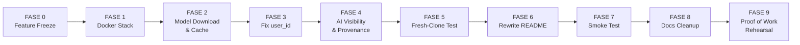

# 📋 Ringkasan Audit LiveCoachHub

> **Sumber**: [AUDIT.docx](file:///home/habiibi/Programs/livecoachhub/AUDIT.docx)
> **Konteks**: COMPFEST 18 — AI Innovation Challenge 2026
> **Tanggal Audit**: 22 Agustus 2026
> **Jenis**: Static repository audit pada branch `main`

---

## 🎯 Tujuan Audit

Menutup **seluruh gap repository** sebelum submission. Fokus utama bukan menambah fitur, tetapi **membuat sistem existing dapat direproduksi secara konsisten** oleh juri.

> [!IMPORTANT]
> **Prinsip Utama**: Jangan menambah fitur baru sebelum P0 selesai. Repository yang bisa di-clone dan dijalankan juri **jauh lebih bernilai** daripada fitur tambahan.

---

## 🔴 12 Temuan Utama

### P0 — Blocker Submission (HARUS diperbaiki)

| ID | Temuan | Dampak |
|----|--------|--------|
| **C-01** | Root `docker-compose.yml` mereferensikan `backend/Dockerfile` yang **tidak ada** | `docker compose build` gagal di backend |
| **C-02** | Dockerfile NLP di `AI/NLP/fine-tuned-indobert/` **tidak ada** | NLP service tidak bisa di-build |
| **C-03** | ~~LLM service belum menjadi bagian aktif dari official Compose stack~~ | ✅ Resolved — menggunakan Gemini API (cloud), tidak perlu LLM container |
| **C-04** | NLP `serve.py` bind ke `127.0.0.1` bukan `0.0.0.0` | Backend container **gagal akses** NLP container |
| **C-05** | README root mengandung **path/struktur lama** yang tidak sesuai repo sekarang | Juri mengikuti instruksi yang salah |

### P1 — Harus selesai sebelum Final Freeze

| ID | Temuan | Dampak |
|----|--------|--------|
| **C-06** | Replay runtime belum membawa `user_id`; orchestrator membentuk pseudo-user dari `comment_id` | Unique-user & anti-spam salah interpretasi |
| **C-07** | Ada Docker Compose frontend terpisah dengan mock backend | Reviewer bisa jalankan stack yang salah |
| **C-08** | Dokumentasi LLM lama & baru **tidak konsisten** | Reviewer bingung mana status aktual |
| **C-09** | Dependency NLP belum dipisahkan training vs inference runtime | Build bisa gagal/berat di container |
| **C-10** | Downloader model tetap tampilkan "sukses" walau download gagal | Tim/juri mengira model siap padahal tidak |
| **C-12** | Belum ada smoke test / integration test formal | Regression bisa lolos sampai demo |

### P2 — Cleanup setelah alur utama stabil

| ID | Temuan | Dampak |
|----|--------|--------|
| **C-11** | Docs/models masih menunjuk lokasi arsitektur lama | Dokumentasi bukan single source of truth |

---

## 🏗️ Rencana Eksekusi (9 Fase)

### FASE 0 — Feature Freeze 🛑
Hentikan semua fitur baru. Setiap perubahan harus menjawab: *apakah membantu build, run, audit, test, atau dokumentasi?*

### FASE 1 — Docker Stack (P0)
- Buat `backend/Dockerfile` (khusus runtime FastAPI)
- Buat `AI/NLP/fine-tuned-indobert/Dockerfile` (inference NLP)
- Ubah NLP host dari `127.0.0.1` → `0.0.0.0`
- Sinkronkan env vars, ports, dan service names

### FASE 2 — Model Download & Cache
- Model NLP otomatis download dari HF saat first-run
- Persist cache dengan Docker volume
- Perbaiki error handling downloader

### FASE 3 — Fix `user_id`
- Tambahkan `user_id` pada JSONL replay, schema frontend, API, backend model
- Hapus pseudo-user `USR-{comment_id}`
- Uji spam filter & unique user count

### FASE 4 — AI Visibility & Provenance
- Health status terpisah per service (backend, NLP)
- Provenance output: `IndoBERT` vs `Heuristic Fallback`, `Gemini API` vs `Template Fallback`
- `DEGRADED` tidak boleh terlihat sebagai `READY`

### FASE 5 — Fresh-Clone Test
- Clone baru di folder kosong → `docker compose up --build`
- **Tanpa** copy model, `.env`, cache, atau file tambahan

### FASE 6 — Rewrite README
- Quick Start copy-paste
- Hardware requirements, model download info, demo scenario
- Dilakukan **setelah** command final stabil

### FASE 7 — Smoke Test
- Health check semua service
- 1 replay end-to-end
- Coach Card muncul dengan provenance = actual AI

### FASE 8 & 9 — Docs Cleanup & Proof of Work Rehearsal

---

## ⚠️ Top 10 Risiko

| ID | Risiko | Level |
|----|--------|-------|
| ~~R-01~~ | ~~Reviewer tidak punya NVIDIA GPU~~ | ✅ Resolved — Gemini API, tidak perlu GPU |
| R-02 | Download HF lambat/gagal | 🔴 Tinggi |
| R-04 | Fallback aktif diam-diam | 🔴 Tinggi |
| R-05 | Dependency Linux tidak cocok | 🔴 Tinggi |
| R-06 | Hidden local file dependency | 🔴 Tinggi |
| R-07 | Port/service networking salah | 🔴 Tinggi |
| ~~R-08~~ | ~~RAM/VRAM tidak cukup → OOM~~ | ✅ Resolved — tidak ada local LLM, RAM cukup 8GB |
| R-03 | Model di-download ulang setiap restart | 🟡 Sedang |
| R-09 | Synthetic augmentation leakage | 🟡 Sedang |
| R-10 | Nondeterministic LLM output | 🟡 Sedang |

---

## ✅ Acceptance Criteria

| ID | Kriteria | Wajib? |
|----|----------|--------|
| AC-01 | Fresh clone tanpa file tambahan | ✅ Wajib |
| AC-02 | Single-command startup (Docker Compose) | ✅ Wajib |
| AC-03 | Model bootstrap otomatis | ✅ Wajib |
| AC-04 | Service health terverifikasi | ✅ Wajib |
| AC-05 | Real AI (IndoBERT + Gemini API, bukan fallback) | ✅ Wajib |
| AC-06 | Correct user identity (`user_id` konsisten) | ✅ Wajib |
| AC-07 | No hidden setup | ✅ Wajib |
| AC-08 | README accuracy | ✅ Wajib |
| AC-09 | Re-run tidak merusak stack | 💡 Disarankan |
| AC-10 | Graceful failure visible | 💡 Disarankan |

> [!CAUTION]
> Repository boleh disebut **READY** hanya jika **AC-01 sampai AC-08 lulus tanpa bantuan manual developer**.

---

## 📅 Timeline yang Disarankan

| Tanggal | Target | Gate |
|---------|--------|------|
| **22 Agustus** | Docker P0 + networking NLP | Tidak ada Dockerfile/path blocker |
| **23 Agustus** | HF bootstrap + LLM + user_id + provenance | Health semua service terverifikasi |
| **24 Agustus** | Fresh clone + smoke test + README rewrite | Satu e2e replay FULL AI sukses |
| **25 Agustus** | Freeze, bug fix, PoW rehearsal, final push | Tidak ada fitur baru; hanya fix & verify |

---

## 🔑 Prioritas Absolut

> **1)** Docker official stack → **2)** NLP model bootstrap/cache → **3)** networking → **4)** user_id correctness → **5)** provenance/health → **6)** fresh clone → **7)** README → **8)** smoke test → **9)** docs cleanup → **10)** Proof of Work
>
> **Jangan membalik urutan ini dengan menambah fitur baru.**
